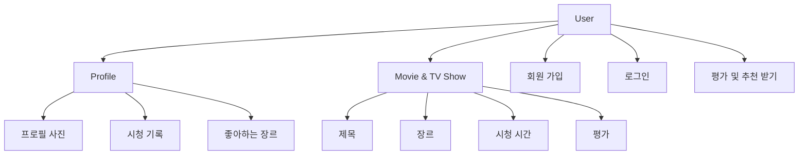

### 개발자용 프롬프트 3가지 이상

- 다음 c로 작성된 코드를 kotlin으로 변경해줘
```c
static void callReplySetSharedData(CallReply *rep, int type, const char *proto, size_t proto_len, int extra_flags) {
    rep->type = type;
    rep->proto = proto;
    rep->proto_len = proto_len;
    rep->flags |= extra_flags;
}

static void callReplyNull(void *ctx, const char *proto, size_t proto_len) {
    CallReply *rep = ctx;
    callReplySetSharedData(rep, REDISMODULE_REPLY_NULL, proto, proto_len, REPLY_FLAG_RESP3);
}

static void callReplyNullBulkString(void *ctx, const char *proto, size_t proto_len) {
    CallReply *rep = ctx;
    callReplySetSharedData(rep, REDISMODULE_REPLY_NULL, proto, proto_len, 0);
}
```
<details>
<summary>Answer</summary>

C에서 Kotlin으로 변환하면서 일부 내용은 가정해야 할 수 있습니다. Kotlin에서는 특정 타입에 대한 정확한 대응이 C와 다를 수 있으므로, 이를 고려하여 아래와 같이 변환하겠습니다:
```kotlin
data class CallReply(
    var type: Int,
    var proto: String,
    var protoLen: Int,
    var flags: Int
)

fun callReplySetSharedData(rep: CallReply, type: Int, proto: String, protoLen: Int, extraFlags: Int) {
    rep.type = type
    rep.proto = proto
    rep.protoLen = protoLen
    rep.flags = rep.flags or extraFlags
}

fun callReplyNull(ctx: Any, proto: String, protoLen: Int) {
    val rep = ctx as CallReply
    callReplySetSharedData(rep, REDISMODULE_REPLY_NULL, proto, protoLen, REPLY_FLAG_RESP3)
}

fun callReplyNullBulkString(ctx: Any, proto: String, protoLen: Int) {
    val rep = ctx as CallReply
    callReplySetSharedData(rep, REDISMODULE_REPLY_NULL, proto, protoLen, 0)
}

// Constants
const val REDISMODULE_REPLY_NULL = // your value here
const val REPLY_FLAG_RESP3 = // your value here
```

주의사항:
+ CallReply 구조체를 data class로 표현했습니다.
+ C의 size_t는 일반적으로 32-bit 또는 64-bit의 부호 없는 정수로, Kotlin에서는 정확한 대응이 없습니다. 여기서는 간단하게 Int로 대체했습니다.
+ 함수 매개변수의 타입들은 가정을 바탕으로 작성되었습니다.
+ 상수 REDISMODULE_REPLY_NULL 및 REPLY_FLAG_RESP3는 적절한 값으로 설정해야 합니다.
+ C의 void *는 Any로 대체하였고, 이를 CallReply로 타입 캐스팅합니다.
+ 실제 사용 전에 코드의 타입과 로직을 확인 및 조정하는 것이 좋습니다.
</details>


- 너가 작성한 앱에 대한 시스템설계 및 아키텍처를 설명해줘

  <details>
  <summary>답변</summary>
    
    이 간단한 카운트 앱은 복잡한 시스템 설계나 아키텍처를 가지고 있지는 않습니다. 그러나 기본적인 설계와 플러터의 위젯 아키텍처를 간단히 설명하겠습니다.
    
    ### 위젯 계층구조
    
    1. `MyApp` 위젯
        - 앱의 루트(Root) 위젯입니다. 이 위젯에서 MaterialApp과 기본 구조를 설정합니다.
    2. `Scaffold` 위젯
        - 앱의 기본 레이아웃을 정의합니다. 앱바(AppBar)와 본문(Body) 등을 포함합니다.
    3. `MyCounter` 위젯
        - 상태를 가지는 `StatefulWidget`입니다. 카운트 상태(`counter`)와 UI를 관리합니다.
    
    ### 상태 관리
    
    - `_MyCounterState` 클래스
        - `MyCounter`의 상태를 관리하는 클래스입니다.
        - `counter` 변수는 현재 카운트 값을 저장합니다.
        - `setState()` 메서드를 통해 `counter` 변수를 업데이트하고 UI를 다시 빌드합니다.
    
    ### 이벤트 처리
    
    - `ElevatedButton` 위젯의 `onPressed` 콜백
        - 버튼을 클릭하면 `setState()`를 호출하여 `counter` 변수를 증가시키고, UI를 업데이트합니다.
    
    ### 설계 패턴
    
    이 앱은 너무 간단하여 특정 아키텍처 패턴 (예: MVC, MVP, MVVM, Redux 등)을 따르지 않습니다. 하지만 상태 관리는 플러터의 `StatefulWidget`을 통해 수행됩니다.
    
    이러한 설계가 적용되면, 특히 간단한 앱에서는 충분히 효율적입니다. 복잡한 앱에서는 보다 구조화된 아키텍처와 상태 관리 방법을 사용할 필요가 있을 수 있습니다.
</details>


- 나는 지금 넷플릭스 UML을 만들고 싶어. 예시 구조를 만들고 네가 제시한 내용을 Mermaid Flow Chart를 통해 UML로 만들어줘
<details>
<summary>Answer</summary>

넷플릭스의 주요 기능과 구조를 간략하게 나타내는 UML 예시와 이를 Mermaid를 사용하여 표현하는 방법을 안내하겠습니다.

먼저, 넷플릭스의 주요 구조와 기능을 고려하여 예시를 제시합니다:

User:

회원 가입
로그인
프로필 생성/수정
영화 및 TV 프로그램 시청
평가 및 추천 받기
Profile:

프로필 사진
시청 기록
좋아하는 장르
Movie & TV Show:

제목
장르
시청 시간
평가
이러한 구조를 바탕으로 Mermaid Flow Chart로 UML을 표현하면 다음과 같습니다:

```
graph TD
  User[User]
  Profile[Profile]
  MovieTVShow[Movie & TV Show]

  User --> SignUp[회원 가입]
  User --> Login[로그인]
  User --> Profile
  User --> MovieTVShow
  User --> RatingRecommendation[평가 및 추천 받기]
  
  Profile --> ProfilePicture[프로필 사진]
  Profile --> WatchHistory[시청 기록]
  Profile --> FavoriteGenre[좋아하는 장르]
  
  MovieTVShow --> Title[제목]
  MovieTVShow --> Genre[장르]
  MovieTVShow --> WatchTime[시청 시간]
  MovieTVShow --> Evaluate[평가]
```

위의 코드를 Mermaid를 지원하는 마크다운 편집기나 렌더러에서 렌더링하면 넷플릭스의 간략한 UML을 볼 수 있습니다.  
참고로, 이 UML은 간략하게 넷플릭스의 주요 기능과 구조를 나타낸 예시이므로 실제 넷플릭스의 전체 구조와 기능을 반영하지 않을 수 있습니다.
</details>


### ADA 프롬프트
- 해당 자료를 토대로 지역별 대기질 그래프를 그려서 자료로 변환해줘
  
  참고자료

  [서울특별시_시간별 (초)미세먼지](https://www.data.go.kr/data/15089266/fileData.do)

  <details>
    <summary>답변</summary>

    

  </details>
  
- 연속이 되기 위해서는 좌극한과 우극한 그리고 점에 대한 값이 동일해야 한다 라는 명제가 참인지 수학적으로 증명해줘

  <details>
  <summary>답변</summary>
  "연속이 되기 위해서는 좌극한과 우극한 그리고 점에 대한 값이 동일해야 한다"는 정확한 명제입니다. 수학에서 함수 $\( f(x) \)$가 $\( x = a \)$에서 연속이라는 것은 다음과 같은 조건을 만족할 때입니다:
  
  
  $\lim_{{x \to a^-}} f(x) = \lim_{{x \to a^+}} f(x) = f(a)$
  
  
  위의 식은 좌극한과 우극한, 그리고 $\( f(a) \)$가 모두 같아야 함을 나타냅니다.
  
  ### 증명
  
  함수 $\( f(x) \)$가 $\( x = a \)$에서 연속이라고 가정하면, 다음의 정의에 따릅니다:
  
  
  $\lim_{{x \to a}} f(x) = f(a)$
  
  
  이것은 다음과 같이 더 자세히 쓸 수 있습니다:
  
  
  $\forall \epsilon > 0, \exists \delta > 0, \text{ such that } 0 < |x - a| < \delta \implies |f(x) - f(a)| < \epsilon$
  
  
  이 정의에 따라, $\( f(x) \)$는 $\( x = a \)$에서 좌극한과 우극한이 모두 $\( f(a) \)$와 같아야 합니다. 왜냐하면 $\( \epsilon > 0 \)$에 대해 $\( \delta > 0 \)$가 존재하여 $\( 0 < |x - a| < \delta \)$일 때 $\( |f(x) - f(a)| < \epsilon \)$이 되어야 하기 때문입니다. 이는 $\( x \)$가 $\( a \)$에 어떤 방향에서 접근하든 같은 결과를 가져야 함을 의미합니다.
  
  따라서, $\( \lim_{{x \to a^-}} f(x) = \lim_{{x \to a^+}} f(x) = f(a) \)$.
  
  이로써 명제가 증명되었습니다.
  </details>

- 너가 간단한 명제를 하나 말하고 그걸 수학적으로 증명해봐
  <details>
    <summary>답변</summary>

    물론입니다. 다음은 기하학에서 유명한 "삼각형의 세 변의 길이의 합은 어떤 한 변의 길이보다 길다"라는 명제입니다.

  ### 명제: 삼각형의 변의 길이의 부등식
  
  실수 $\(a, b, c\)$가 삼각형의 세 변의 길이라고 할 때, 다음의 부등식이 성립한다:
  
  
  $a + b > c$
  
  $a + c > b$
  
  $b + c > a$
  
  
  ### 증명
  
  이 명제를 증명하기 위해 삼각형의 세 변의 길이를 $\(a, b, c\)$라고 하고, 이 삼각형이 유효하다고 가정하겠습니다.
  
  1. $\(a + b > c\)$
  
  이 부등식을 증명하기 위해 삼각형의 한 꼭지점에서 두 변 $\(a\)$와 $\(b\)$가 만나고, 이 두 변을 연결하는 선분의 길이가 $\(c\)$라고 합시다. 그럼 이 선분 $\(c\)$는 변 $\(a\)$와 변 $\(b\)$의 합보다는 짧아야 합니다. 왜냐하면 선분 $\(c\)$는 변 $\(a\)$와 변 $\(b\)$를 최단 거리로 연결하기 때문입니다.
  
  2. $\(a + c > b\)$
  
  이 부등식도 첫 번째 부등식과 같은 논리로 증명할 수 있습니다.
  
  3. $\(b + c > a\)$
  
  이 부등식 역시 첫 번째 부등식과 같은 논리로 증명할 수 있습니다.
  
  이로써, 삼각형의 모든 변에 대한 부등식이 성립함을 증명했습니다.
  </details>

### 플러그인 프롬프트
1. Github
   - 깃헙으로 협업하는 방법을 다이어그램으로 표현해줘.
<details>
<summary>Answer</summary>
  
깃헙으로 협업하는 방법을 나타내는 다이어그램입니다:  


commit: 초기 커밋을 두 번 수행합니다.
branch develop: 'develop' 브랜치를 생성합니다.
checkout develop: 'develop' 브랜치로 전환합니다.
commit: 'develop' 브랜치에서 커밋을 두 번 수행합니다.
checkout main: 다시 'main' 브랜치로 전환합니다.
merge develop: 'develop' 브랜치의 변경 사항을 'main' 브랜치로 병합합니다.
commit: 'main' 브랜치에서 추가로 커밋을 두 번 수행합니다.

이 다이어그램은 기본적인 깃헙의 브랜치 전략을 보여줍니다. 'develop' 브랜치에서 작업을 수행한 후, 그 작업을 'main' 브랜치로 병합하는 과정을 나타냅니다.
</details>
2. Wikipedia
    - 최초의 프로그래머 에이다 러브레이스에 대해 알려줘
      <details>
        <summary>답변</summary>
        에이다 러브레이스(Augusta Ada King, Countess of Lovelace, 1815년 12월 10일~1852년 11월 27일)는 영국의 수학자이자 세계 최초의 프로그래머로 알려져 있습니다. 그녀는 영국의 저명한 시인 조지 고든 바이런의 딸로 태어났습니다. 에이다 러브레이스는 찰스 배비지의 연구에 대한 좋은 이해자이자 협력자였고, 배비지가 고안한 해석기관(Analytical Engine)을 위한 공동작업으로 널리 알려져 있습니다.
        
        에이다는 해석기관에서 처리될 목적으로 작성된 알고리즘이 최초의 컴퓨터 프로그램으로 인정되었기 때문에 '세계최초의 프로그래머'라는 수식어가 붙습니다. 당시의 과학자들이 해석기관을 단순한 계산기나 수치 처리 장치로만 생각했던 것과 달리, 그녀는 이를 훨씬 다양한 목적으로 활용될 수 있는 가능성에 주목했습니다.
        
        에이다 러브레이스는 프로그래밍 언어에서 사용되는 중요한 개념인 루프, GOTO문, IF문과 같은 제어문의 개념을 소개했습니다. 그녀는 또한 서브루틴에 관한 개념도 고안했으며, 이러한 개념은 1948년에 모리스 윌키스가 개발한 최초의 어셈블리어에도 추가되었습니다. 에이다 프로그래밍 언어는 그녀의 이름을 따서 만들어진 프로그래밍 언어입니다.
        
        에이다 러브레이스는 어린 시절부터 병약했고, 여러 차례 심각한 질병을 앓았습니다. 그녀의 어머니는 에이다가 아버지를 닮는 것을 두려워하여 문학 대신에 수학과 논리학에 심취하게끔 유도했습니다. 에이다는 윌리엄 프렌드, 매리 소머빌 등의 저명한 19세기 과학자들에게 수학과 과학을 배웠습니다.
        
        더 자세한 정보는 [위키백과](https://ko.wikipedia.org/wiki/%EC%97%90%EC%9D%B4%EB%8B%A4_%EB%9F%AC%EB%B8%8C%EB%A0%88%EC%9D%B4%EC%8A%A4)에서 확인할 수 있습니다.
        
        이 내용은 [Wikipedia](https://www.wikipedia.org/), 자원 봉사자들에 의해 만들어진 무료 백과사전에서 출처되었습니다. Wikipedia는 [Creative Commons Attribution-ShareAlike License](https://creativecommons.org/licenses/by-sa/4.0/) 하에 이용할 수 있으며, Wikimedia Foundation이라는 비영리 단체에서 호스팅됩니다. [기부를 통해 이 비영리 단체를 지원할 수 있습니다](https://donate.wikimedia.org/?utm_medium=chatGPT&utm_campaign=chatGPTplugin&utm_source=chatGPTplugin_en_v1). 위키백과 플러그인의 경험이 어떠셨는지 알려주시면 Wikimedia Foundation이 개선하는 데 도움이 됩니다. [이 짧고 익명의 설문조사](https://forms.gle/rN8DA2XpvsrjeM1a7)에 참여해 주시면 감사하겠습니다. 3분 정도 소요됩니다.
      </details>
3. Link Reader
    - https://www.yes24.com/Product/Goods/117936860?ReviewYn=Y

      책의 내용을 요약해줘

      <details>
        <summary>답변</summary>
        해당 웹페이지에서 제공된 정보에 따르면, 이 책은 "진짜 챗GPT 활용법"이라는 제목으로, 챗GPT의 다양한 활용 방법에 대해 다룹니다. 책은 ChatGPT의 기본 원리와 사용법을 설명하고, 블로그 작성, 영상 제작, 업무 등에서 어떻게 활용할 수 있는지에 대한 실질적인 방법을 제시합니다. 일상과 업무에서 ChatGPT와 다른 AI 도구를 효율적으로 사용하는 방법을 알려주는 것이 주 목적입니다.
        
        발행일은 2023년 3월 21일이며, 책은 총 304쪽으로 구성되어 있습니다. ISBN13 번호는 9791158394264입니다.
        
        책은 다음과 같은 카테고리에 분류됩니다:
        - 국내도서 > IT 모바일 > 컴퓨터 입문/활용 > 인터넷 입문서
        - 국내도서 > IT 모바일 > 오피스 활용 > MS Office
        - 국내도서 > 경제 경영 > 경영 > 경영전략/경영혁신
        - 국내도서 > 경제 경영 > 인터넷비즈니스 > e-비즈니스
        - 국내도서 > 자기계발 > 기획/정보/시간관리
        
        이 외에도 다양한 이벤트와 사은품이 준비되어 있습니다.
        
        Respect copyrights. Issues or features? Email us at care@sider.ai.  Use Link Reader in every tab? [Get it here.](https://sider.ai/lp/extension1?source=lr&p1=card1&p2=lp)
      </details>
